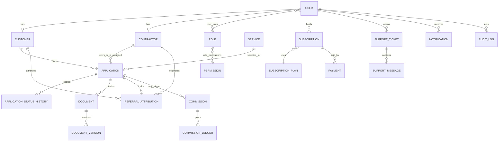

# Phase 1 — Product Architecture and Implementation Plan

Status: complete  
Stack: JavaScript only · React/Vite · Express · MongoDB Atlas/Mongoose · Cloudinary · Netlify · Render

## 1. Product boundary

VFS Groups is one platform with four experiences sharing a versioned REST API:

1. A premium public financial-services website and lead funnel.
2. An authenticated customer workspace for applications, documents, subscriptions, notifications, and support.
3. An authenticated contractor workspace for referrals, authorized customers, applications, subscriptions, commissions, reports, and support.
4. A permission-driven operations console for CRM, finance, content, communications, reporting, settings, and immutable audit history.

The platform assists with applications; it must never present VFS Groups as a lender/insurer or guarantee approval, rates, disbursement, policy returns, or claims. Company naming, contractor label, legal wording, contact information, plan configuration, and published content are settings/CMS data.

## 2. Architecture decisions

```text
Netlify / React SPA
  ├── Public routes (SEO metadata, services, calculators, forms)
  ├── Customer routes (ownership-scoped)
  ├── Contractor routes (assignment/referral-scoped)
  └── Admin routes (permission-scoped)
          │ HTTPS + secure cookies + CSRF header
          ▼
Render / Express API /api/v1
  ├── HTTP layer: routes, rate limits, validation, responses
  ├── Application layer: use-cases and transactions
  ├── Policy layer: authentication, permissions, ownership
  ├── Domain layer: services, applications, referrals, finance
  ├── Provider layer: storage, email, SMS, WhatsApp, payments, AI
  ├── Job layer: notifications, expiries, reports, webhooks
  └── Data layer: Mongoose models and indexed queries
          │
          ├── MongoDB Atlas (system of record)
          ├── Cloudinary private/authenticated assets
          └── Optional Redis (OTP, queue, cache, distributed locks)
```

Key decisions:

- Use a monorepo with independent `client` and `server` deployments.
- Keep controllers thin; business rules and authorization live in services/policies.
- Use access and rotating refresh JWTs in HTTP-only cookies. Store hashed refresh-token identifiers for revocation and session management.
- Require a CSRF token on cookie-authenticated mutations in production.
- Validate all input at route boundaries with Zod and re-check resource ownership in backend policies.
- Treat MongoDB as the system of record. Mock adapters are permitted only for third-party delivery/storage/payment/AI in development, never as fake business data.
- Store sensitive media metadata and Cloudinary `public_id`; create short-lived signed delivery URLs only after authorization.
- Use MongoDB transactions for attribution correction, status transition/history, payment/subscription activation, and commission ledger adjustments.
- Never derive dashboard figures from fixtures. Dashboard endpoints aggregate authorized MongoDB records.
- Use configurable counters for public IDs and unique indexes for application, customer, contractor, referral, payment, and subscription identifiers.

## 3. Repository/module structure

```text
client/src/
  app/             router, providers, route guards, query client
  components/      design-system, layout, forms, data display
  features/        auth, services, applications, referrals, subscriptions,
                   support, contact, gallery, customer, contractor, admin
  pages/           route-level compositions only
  services/        axios client and endpoint adapters
  styles/          tokens and global accessibility styles
  utils/           formatting, calculations, URL/referral helpers

server/src/
  config/          validated env, database, logger
  middleware/      auth, RBAC, CSRF, validation, errors, uploads, idempotency
  models/          Mongoose schemas and indexes
  modules/         domain routes/controllers/services/validators/policies
  providers/       interfaces plus real/mock adapters
  jobs/            schedulers and queue processors
  seeds/           reference data and initial administrator
  utils/           identifiers, crypto, pagination, API responses
  app.js            Express composition
  server.js         process/bootstrap concerns
```

## 4. Sitemap

Public: `/`, `/about`, `/services`, `/services/:slug`, `/eligibility`, `/emi-calculator`, `/apply`, `/track`, `/partner`, `/partner/register`, `/register`, `/gallery`, `/faqs`, `/contact`, `/privacy`, `/terms`, `/disclaimer`, `/refund-policy`, `/cookie-policy`, `/maintenance`, and catch-all 404.

Authentication: `/sign-in`, `/customer/sign-up`, `/contractor/sign-in`, `/contractor/sign-up`, `/admin/sign-in`, `/forgot-password`, `/reset-password/:token`, `/verify-otp`, `/verify-email/:token`, `/admin/two-factor`.

Customer: `/customer`, `/customer/applications`, `/customer/applications/:id`, `/customer/documents`, `/customer/subscription`, `/customer/support`, `/customer/support/:id`, `/customer/profile`, `/customer/notifications`.

Contractor: `/contractor`, `/contractor/referrals`, `/contractor/customers`, `/contractor/customers/:id`, `/contractor/applications`, `/contractor/applications/:id`, `/contractor/commission`, `/contractor/subscription`, `/contractor/reports`, `/contractor/support`, `/contractor/profile`.

Admin: `/admin`, then domain routes for leads, applications, assignments, customers, contractors, admins, roles, permissions, plans, subscriptions, payments, invoices, refunds, commissions, rules, services, FAQs, gallery, testimonials, team, pages, banners, announcements, enquiries, callbacks, tickets, chatbot, WhatsApp, notifications, templates, reports, audit, login activity, webhooks, jobs, integrations, general settings, and security settings.

## 5. Primary user journeys

### Visitor to application

Service discovery → service detail or guided finder → indicative eligibility/EMI calculation → application draft → contact verification → financial/service-specific data → immutable referral capture → protected document upload → consent record → transactional submission → generated lead/application IDs → acknowledgement/tracking.

### Secure public tracking

Application ID + registered mobile → rate-limited OTP challenge → OTP verification → short-lived tracking grant → customer-safe status/timeline only. Internal notes and non-public documents are never serialized.

### Customer

Register/verify → authenticated overview from aggregate API → create/resume applications → satisfy document requests → view public status history → manage subscription/payment → receive notifications → open/reply to support ticket.

### Contractor

Register → verify contact channels → submit KYC and bank data securely → admin review → activate subscription → receive contractor/referral IDs → share tracked link → manage authorized referrals/applications → view ledger-backed commission → export permission-scoped reports.

### Operations/admin

Admin 2FA → permission-driven navigation → queue requiring action → resource detail → authorized mutation with reason → transaction writes business record + history/ledger + audit record → user-safe notification queued.

## 6. Data architecture

Collections follow the specification and are grouped by domain:

- Identity: `users`, `user_profiles`, `roles`, `permissions`, `user_roles`, `role_permissions`, `refresh_tokens`, `login_history`, `otp_challenges`, `consent_records`.
- People: `customers`, `contractors`, `contractor_kyc`.
- Catalog/CMS: `service_categories`, `services`, `service_requirements`, `service_faqs`, `pages`, `page_sections`, `faqs`, `team_members`, `testimonials`, `announcements`, `gallery_categories`, `gallery_items`.
- Application CRM: `leads`, `applications`, `application_details`, `application_assignments`, `application_status_history`, `application_notes`, `tasks`, `activity_logs`.
- Documents: `documents`, `document_versions`, `document_requests`.
- Referral: `referrals`, `referral_clicks`, `referral_attributions`.
- Subscription/finance: `subscription_plans`, `plan_features`, `subscriptions`, `subscription_usage`, `payments`, `payment_transactions`, `payment_webhook_events`, `refunds`, `invoices`, `commission_rules`, `commissions`, `commission_ledger`.
- Communication: `contact_enquiries`, `callback_requests`, `support_tickets`, `support_messages`, `notifications`, `notification_templates`, `notification_deliveries`, `chat_conversations`, `chat_messages`, `chat_feedback`, `knowledge_base_articles`, `whatsapp_leads`, `whatsapp_messages`, `whatsapp_opt_ins`.
- Platform: `audit_logs`, `integration_settings`, `system_settings`, `scheduled_job_logs`, `counters`, `idempotency_keys`.

### Relationship diagram



Important indexes:

- Unique normalized email/mobile where present; sparse indexes for optional identifiers.
- Unique `customerId`, `contractorId`, `referralCode`, `leadId`, `applicationId`, `subscriptionId`, `paymentId`, and `commissionId`.
- Applications: `{customer:1, createdAt:-1}`, `{contractor:1,status:1}`, `{service:1,status:1,createdAt:-1}`.
- Status history: `{application:1,createdAt:1}`; documents: `{application:1,type:1,status:1}`.
- Referrals: unique locked attribution per submitted application; click analytics indexed by code/date.
- Subscriptions: `{user:1,status:1,endDate:1}`; jobs query `{status:1,endDate:1}`.
- Audit records: `{resourceType:1,resourceId:1,createdAt:-1}` and `{actor:1,createdAt:-1}`; no update/delete application route.

## 7. API structure

All endpoints are rooted at `/api/v1`; success responses use `{ success, data, meta? }`, failures use `{ success:false, error:{ code,message,fields?,requestId } }`.

| Domain | Representative routes |
| --- | --- |
| System | `GET /health`, `GET /ready` |
| Auth | `register`, `login`, `refresh`, `logout`, `me`, verification, password reset, OTP, admin 2FA, sessions |
| Services/CMS | published listing/detail; protected CRUD/publish/preview |
| Leads/Contact | enquiries, callbacks, eligibility submissions; protected queues/status |
| Applications | draft CRUD, submit, authorized list/detail, assign, status transitions, notes, acknowledgement |
| Tracking | challenge OTP, verify, read customer-safe tracking result |
| Documents | request, upload, version, signed access, verify/reject/re-upload |
| Referrals | resolve, click, attribution, contractor analytics, audited admin correction |
| Subscriptions | plans, current, checkout/renew/cancel, usage, protected administration |
| Payments | intent, offline proof, provider webhooks, history, receipts/refunds |
| Commissions | authorized list/detail, rules, verify/approve/hold/pay/reverse ledger actions |
| Support | tickets/messages/attachments/status/assignment |
| Communication | notifications/preferences, WhatsApp opt-in/webhooks, chatbot conversations/escalation |
| Dashboards | role-specific aggregate endpoints querying the database |
| Reports | permission-scoped filters and asynchronous export jobs |
| Admin/System | roles, permissions, settings, integrations, audit, logs, jobs |

Mutations that create financial records, submit applications, process webhooks, or change ledgers require an idempotency key. List routes use bounded pagination, allowlisted sort fields, and indexed filters.

## 8. RBAC and object policies

| Capability | Customer | Contractor | Ops/Application | Finance | Support | Content | Admin/Super Admin |
| --- | --- | --- | --- | --- | --- | --- | --- |
| Own profile/subscription | own | own | view assigned | finance view | support view | — | manage |
| Applications | own create/view | referred/assigned create/view | manage/assign/status | finance fields | support-safe view | — | manage |
| Documents | own upload/view | authorized upload/view | request/verify | allowed view | limited | — | manage |
| Referral | own attribution view | own analytics | audited correction | commission view | — | — | manage |
| Payments/commissions | own payments | own ledger | limited | manage/approve/pay | — | — | manage |
| Support | own | own | view | view | manage | — | manage |
| Content | published read | published read | read | read | read | manage/publish | manage |
| Audit/settings/RBAC | — | — | scoped read | scoped read | — | — | permission-controlled |

Permissions use explicit strings such as `applications.status.update`; roles merely group permissions. Every resource route also enforces ownership, referral/assignment, or organizational scope. Frontend guards improve UX but are never security controls.

## 9. Security/privacy model

- Passwords use bcrypt with configurable cost; login has rate limiting, failed-attempt counters, temporary lockout, and security audit events.
- Access cookie is short lived; refresh tokens rotate and reuse invalidates the session family.
- Admin roles require verified contact channels and TOTP/recovery-code 2FA before privileged access.
- Encrypt PAN/bank values at the application layer with versioned AES-GCM keys; serialize only masked variants by default.
- Uploads are allowlisted by MIME/signature/size, receive safe random names/checksums, and pass a malware-scanning integration hook.
- Public tracking and OTP endpoints are separately rate limited and return non-enumerating responses.
- Provider webhooks require signature validation, event persistence, idempotency, then asynchronous processing.
- Validate/normalize Zod input, sanitize MongoDB operators, use Helmet/CSP, strict CORS allowlists, secure cookie flags, request IDs, and structured redacted logs.
- Consent, data export/deletion requests, retention schedules, backup, and recovery are documented operational processes.

## 10. Frontend system

Design tokens implement the specified 70/20/10 balance: off-white/white surfaces, deep teal structure, and strategic gold interaction accents. Manrope headings and Inter body text are loaded with fallbacks. Components target WCAG 2.2 AA: skip link, semantic landmarks, keyboard menus/dialogs, visible focus, explicit labels/errors, live regions, responsive tables, reduced motion, and contrast-safe statuses.

TanStack Query owns server state. React Hook Form + Zod own form state/validation. Axios sends credentials and CSRF headers. Route modules are lazy loaded. No dashboard includes placeholder metrics; loading, empty, and error states remain visible until aggregate APIs respond.

## 11. Provider contracts

`StorageProvider`, `EmailProvider`, `SmsProvider`, `WhatsAppProvider`, `PaymentProvider`, and `AiProvider` expose stable server-only interfaces. Development mock providers log redacted delivery metadata and deterministic IDs; they never claim external delivery or payment. Production adapters activate only when their complete secret set is present. Startup fails in production when a required enabled provider is misconfigured.

## 12. Phase roadmap and gates

### Phase 2 — Foundation

- Build: monorepo tooling, design system, Express baseline, validated configuration, database connection, core schemas/indexes, identifier service, authentication/session architecture, RBAC middleware, audit primitive, provider contracts, seed framework.
- Database: identity/RBAC, counters, customer/contractor profiles, services, applications/history, refresh tokens, audit.
- APIs: health, auth/me/session, published services, protected policy probes.
- Security: cookies, CORS, Helmet, rate limits, validation, redacted errors/logging.
- Acceptance: JavaScript-only check, lint/build/tests pass, seeds are idempotent, unauthorized/forbidden/ownership cases tested.

### Phase 3 — Public experience

- Build: global shell, homepage, all service pages, finder, EMI, eligibility, application funnel, tracking challenge, gallery, contact/callback, FAQs/legal, technical SEO.
- Database: CMS/service content, enquiries, callbacks, eligibility leads, drafts, documents, OTP grants.
- APIs: published CMS/services/gallery/FAQ, enquiries/callbacks, calculator estimate export, eligibility, application draft/submit, tracking OTP.
- Security: anti-spam, upload validation, referral lock, consent evidence, enumeration-safe tracking.
- Acceptance: every actionable control reaches an API or deliberate route; all 14 services exist; responsive/a11y review; no fabricated claims.

### Phase 4 — Customer

- Build: registration/verification, aggregate dashboard, applications/detail, document center, notifications, subscription/payment history, support.
- Database/APIs: full customer, document, subscription, payment, support, notification domains.
- Security: ownership policies, signed assets, internal-note exclusion, session management.
- Acceptance: critical journey integration/E2E tests and zero cross-customer access.

### Phase 5 — Contractor

- Build: onboarding/KYC, approval state, dashboards, referral center, authorized customer/application work, subscriptions, reports, commission ledger.
- Security: KYC/bank encryption, assignment/referral policy, export authorization.
- Acceptance: duplicate-safe IDs/codes, attribution integrity tests, expired-plan gates, no cross-contractor access.

### Phase 6 — Admin operations

- Build: actionable aggregates and complete permission-scoped CRUD/workflows for CRM, finance, CMS, communications, reports, settings, and audit.
- Security: admin 2FA, reasons on sensitive actions, immutable audit, maker/checker-ready finance actions.
- Acceptance: permission matrix tests, transactional history/ledger/audit assertions, responsive operations views.

### Phase 7 — AI assistant

- Build: approved knowledge retrieval, public lead/service help, authenticated tool calls, escalation/review.
- Security: strict tool authorization and safe serialization; no free access to database context.
- Acceptance: adversarial data-isolation and financial-claim tests.

### Phase 8 — WhatsApp

- Build: official provider adapter, templates, opt-ins, leads, notifications, signed/idempotent webhooks, human handover.
- Acceptance: no unofficial automation; delivery state and retry tests.

### Phase 9 — Production hardening

- Build: comprehensive testing, security/accessibility/performance/SEO audits, queues, observability, backup/recovery, Netlify/Render configuration and runbooks.
- Acceptance: lint/unit/integration/E2E/build pass, WCAG 2.2 AA review, deployment health checks, restore rehearsal documented.

## 13. Definition of done for every phase

At phase start, record modules/files, schema changes, routes, security controls, and acceptance tests. At phase end, run lint, unit/integration tests, production builds, authorization review, responsive review, and accessibility review; fix findings; record limitations and next-phase prerequisites. A UI action is not complete until its authenticated/authorized API, persistence, validation, error state, audit needs, and test coverage are addressed.
